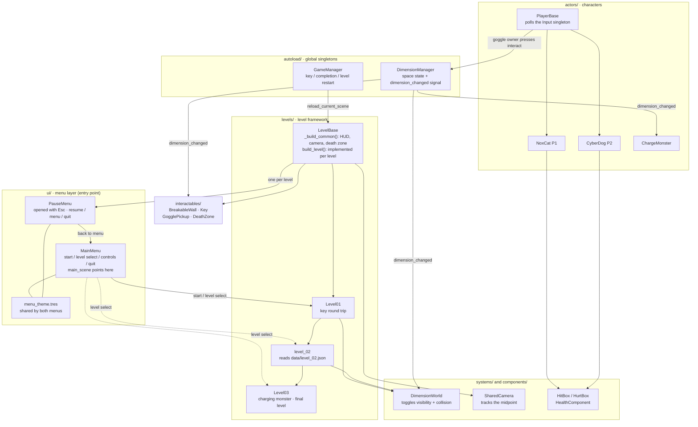

# NoxCat: Riftbound Co-op

> Local two-player co-op puzzle platformer · Godot 4.7.2
> Team: **水返腳(2).png** (team code T054)
> [中文說明](README.md)

---

## Problem & Goals

Most co-op games hand both players an identical moveset, so "cooperation" degrades into "walking the same path together" — losing a partner makes you slower, not stuck.

This project attacks that directly: **make the two players' abilities deliberately asymmetric and mutually dependent.** The game holds two overlapping spaces; the same coordinate has different platforms in the *normal space* and the *alternate space*. Only NoxCat, the black cat wearing the goggles, can switch between them. CyberDog cannot switch at all — yet climbing the tower and luring the charging monster into the cracked wall both require two bodies on the field. Level gaps are deliberately wider than a single jump, so switching spaces is the only solution rather than an optional flourish.

**Target users:** two players sharing one keyboard at the same desk.
**Intended impact:** make communication a requirement for progress — the player who can *see* the platform has to say so, and the player who can *stand* on it has to trust them.

## Core Features

- **Two overlaid spaces** — the inactive space is simultaneously invisible *and* non-solid; switching is instant (`systems/DimensionWorld.gd` toggles `visible` and the `disabled` flag on every descendant collision shape together)
- **Asymmetric abilities** — only NoxCat can pick up the goggles (CyberDog uses a wrist device), so only the cat can flip spaces
- **Shared camera and tether** — one camera tracks the midpoint of both players; they cannot separate more than 820 px on the X axis, though walking back toward each other is always allowed
- **Level 1 — key round trip** — climb an alternating staircase by flipping spaces, grab the key at the far right, carry it back to the door at the spawn point
- **Level 2 — data-driven vertical tower** — geometry is defined entirely by [`data/level_02.json`](data/level_02.json); the left-hand steps exist only in normal space and the right-hand ones only in alternate space, so you flip as you climb
- **Level 3 — lure the charging monster** — flipping to alternate space enrages the slime; bait it toward the cracked wall and let it smash a passage. The slime patrols the pit when idle and only detects players standing on its own level (the cat is safe up on the high platform); it plays a death animation and disappears after breaking the wall, and if it misses it is stunned briefly and returns to patrol so you can bait it again
- **The exit takes both players** — all three levels use the same `LevelBase.exit_trigger()`: both players must stand in the doorway to advance, and whoever arrives first sees a hint
- **Player action sounds** — run loop, jump, attack, hit, death and device activation each have a sound effect, driven by the procedurally synthesised wav files
- **Death restarts the level** — no lives; if either player dies or falls, the whole level reloads after one second
- **Main menu and level select** — start game / **level select (jump straight to level 1, 2 or 3)** / controls / quit, over a backdrop reusing the crimson alternate-space skyline with a translucent dark layer to keep text legible; press `Esc` in game to pause, then resume, return to the menu or quit
- **Debug HUD** — **hidden by default**, press F1 to bring it up; shows the current space, goggle owner, key state and both players' HP. The play screen only keeps the control hints

## System Architecture



How the usual layers map onto this project:

| Layer | This project |
|---|---|
| Frontend | The Godot client *is* the entire presentation and interaction layer; the web build runs via WebAssembly + WebGL2 |
| Backend | **None.** Purely local single-machine game; it makes no network requests at runtime |
| Model | **Development-time only.** Art assets were produced with an image-generation model and then sliced; the game never calls an AI service at runtime |
| Database | **None.** Level data is read from static JSON (`data/level_02.json`) at startup |
| External services | Only itch.io (web hosting) and GitHub Releases (desktop distribution) |

Directory responsibilities:

| Directory | Contents |
|---|---|
| `ui/` | **Main menu, level select, Esc pause menu and the shared** `menu_theme.tres`. `run/main_scene` points at `ui/MainMenu.tscn` — this is the game's entry point |
| `autoload/` | Two global singletons: space state and cross-level game state |
| `levels/` | `LevelBase` framework plus each level. **Level geometry is built procedurally in GDScript**; the `.tscn` files are empty `Node2D`s carrying a script |
| `actors/` | Players (`PlayerBase` plus two character scenes) and enemies |
| `components/` | Composable components: `HitBox` / `HurtBox` / `HealthComponent` |
| `interactables/` | Key, goggles, breakable wall, death zone and friends |
| `systems/` | Space switching and the shared camera |
| `assets/` | Art (153 PNGs), audio (8 wav + 3 mp3), and `fonts/` holding the Chinese subset font plus its OFL licence text |
| `data/` | Static level data (currently only `level_02.json`) |
| `tools/` | Sound synthesis script, Chinese font subsetter, local static server, export template installer |
| `docs/` | [Release guide](docs/release-guide.md) (GitHub Release and itch.io upload steps), plus `plan-v5.md` (**a plan for an earlier prototype — not the current architecture**) |
| `development-log/` | Per-session design decision records, five entries. The latest covers [the menu, exit unification and slime rework](development-log/2026-09-05-menu-exit-unify-slime-rework.md) |
| `AGENTS.md` | Project working agreements plus two hard architecture rules (always poll the `Input` singleton; cross-node initialisation always flows parent-to-child), both of which the code actually follows |

## Tech Stack

| Category | Technology / Service | Purpose |
|---|---|---|
| AI model | OpenAI ChatGPT Images 2.0 (API name `gpt-image-2`) | **Development-time asset production only**: generated contact sheets for characters, enemies, backgrounds and platforms, then sliced into frames by our own pipeline. The game calls no AI API at runtime |
| Frontend | Godot Engine 4.7.2 stable + GDScript, `gl_compatibility` renderer | The game itself: rendering, input, 2D physics, level construction. The web build runs on WebAssembly + WebGL2 |
| Backend | None | Purely local single-machine game — no server, no network requests, no database. Level data loads statically from `data/level_02.json` |
| Sponsor technology | OpenAI ChatGPT (team's own account) | Development-time asset generation. The Pro plan and API credits offered by the organisers had not been provisioned by the submission deadline, so this was done on a team member's own account — no sponsor credits were used and no OpenAI API was called |
| Distribution | itch.io (HTML5), GitHub Releases | itch.io serves the click-and-play browser build; GitHub Releases carries the single-file Windows build |
| Tooling | Node.js, Python 3 | `tools/generate_dog_sfx.js` synthesises the sound effects; `tools/serve.py` serves the web build locally |

> The renderer is pinned to `gl_compatibility` out of necessity, not preference: **WebGL2 only supports Compatibility**, and this game must run in a browser. Consequently no glow, SSAO, SDFGI, volumetric fog or screen-space reflections are used.

## Install & Run

### Option 1 — Play in a browser

itch.io page: <https://kila606.itch.io/2026fht04501>

Open the link and press **Run game** — no download or install. The first load pulls about 29 MB, so give it a moment.
This is a local two-player game: **two people share one keyboard**, and there is no single-player mode.

### Option 2 — Download the Windows build

```
1. Go to this repository's Releases page and download NoxCat-Riftbound-Coop-v1.0.0-windows.zip
2. Extract it
3. Double-click NoxCat-Riftbound-Coop.exe
```
All resources are embedded in the executable — a single `.exe` after extraction, no Godot installation required.

### Option 3 — Run from source

```bash
# 1. Install Godot 4.7.2 stable (the standard build; the .NET build is not needed)
#    https://godotengine.org/download

# 2. Get the source
git clone https://github.com/RainYu0510/hackathon.git
cd hackathon

# 3. Open project.godot in Godot and press F5
#    Main scene: ui/MainMenu.tscn
```

### Option 4 — Reproduce both builds yourself

```bash
# Install the Godot 4.7.2 export templates first (Editor menu: Editor -> Manage Export Templates)
# On Linux, tools/install_export_templates.sh automates this

godot --headless --import
godot --headless --export-release "Windows Desktop" build/windows/NoxCat-Riftbound-Coop.exe
godot --headless --export-release "Web" build/web/index.html

# Preview the web build locally (http://127.0.0.1:8099)
python tools/serve.py
```
The export configuration is version-controlled (`export_presets.cfg`), so these commands produce identical results from any clone.

### Controls

**Both players share one keyboard.**

| | Player 1 — NoxCat | Player 2 — CyberDog |
|---|---|---|
| Move | `A` / `D` | `←` / `→` |
| Jump | `W` | `↑` |
| Attack | `F` | `K` |
| Interact / switch space | `G` | `L` |

| In game | Effect |
|---|---|
| `Esc` | Pause (resume / main menu / quit) |
| `R` | Restart the current level |

| Debug key | Effect |
|---|---|
| `F1` | Show / hide the debug HUD (hidden by default) |
| `F2` | Force normal space |
| `F3` | Force alternate space |

> The interact key is overloaded: while holding the goggles it switches spaces, otherwise it picks up / interacts.
>
> The Quit button in both the main menu and the pause menu **hides itself in the browser build** (a browser tab cannot close itself); it only appears in the desktop build.

## Showcase

- Demo URL: <https://kila606.itch.io/2026fht04501> (itch.io, plays in the browser)
- Judging video: *not yet produced*

## Limitations & Future Work

Everything below was verified against the source, not assumed:

**Levels and flow**
- **Three playable levels**: 1 → 2 → 3. Level 3 is the last one; finishing it shows `LEVEL COMPLETE` and `R` replays it
- **There is no level 4**: `levels/Level04.gd` / `Level04.tscn` (an earlier, cruder version of level 3 where breaking the wall *is* the win condition) have been deleted. Nothing routed to them and they were kept around as dead code, but `Level04.gd.uid` held the same UID as `Level03.gd.uid` — on export every `.tscn` becomes a binary `.scn` that embeds its ext_resource's UID, and the loader prefers that UID over the stored path, so **exported builds** ran `Level04.gd` for level 3. This never reproduces in the editor: a text `.tscn`'s `[ext_resource]` carries no `uid=` field and loads purely by path. Never copy an existing `.uid` when adding a file
- `Level03_PLACEHOLDER.tscn` and `Level05_PLACEHOLDER.tscn` only render a `LEVEL DESIGN TBD` label and are likewise unreachable
- The filenames mislead: `Level02_PLACEHOLDER.tscn` is **not** a placeholder — it carries `levels/level_02.gd`, the real playable level 2

**Inconsistencies and unwired content**
- **Audio covers player actions only**: `actors/players/PlayerBase.gd` plays run / jump / attack / hit / death / device sounds. There is **no background music, no menu audio and no enemy audio**. Both characters share the same `dog_*` clips, and `dog_idle.wav`, `dog_sfx_preview.wav` and the three MP3s remain unreferenced by any code
- **Player attacks have no target in the playable levels**: the level 3 enemy (class `ChargeMonster`, drawn with the slime art) has no `HurtBox` and cannot be killed, and `Slime.tscn` — the only entity carrying an enemy `HurtBox` — is never spawned by any level. So `F` / `K` hit nothing across all three levels
- **The level 3 enemy is a one-hit kill**: its `HitBox` has `damage = 99` against a player `HealthComponent` with `max_health = 5`, so being caught by a charge kills instantly and reloads the level
- **Checkpoints are purely decorative**: the door-shaped objects do not act as respawn points. Death always reloads the level, and `GameManager.respawn_all()` has no callers
- Player 2's `p2_left` / `p2_right` are bound to incorrect physical keycodes in `project.godot` (they map to Insert and Pause). The arrow keys work only through a hardcoded fallback input path for player 2 in `actors/players/PlayerBase.gd`
- Once a character holds the goggles, the interact key is consumed by space switching and that character can no longer pick anything up
- **The tether gives no visual feedback**: at 820 px apart, outward movement input is silently zeroed with nothing on screen to explain it
- **29 PNGs are referenced by no code at all**: `LevelBase.platform()` only ever loads `platform_02/03` and their crimson counterparts, so the other ten platform variants (20 files across both palettes), the portal art (7 files) and the two platform atlases all sit idle. A further 10 files — the slime's attack and jump frames — are referenced only by the never-spawned `Slime.tscn` and so never appear in play
- `interactables/CollapsingPlatform.gd` and `ui/HUD.tscn` are dead paths: `Level01._collapse()` has no callers and `LevelBase.collapse_platforms` is always empty; the real HUD is built in code by `LevelBase._build_common()`, and nothing references `ui/HUD.tscn`
- **The bundled font is a subset**: `assets/fonts/NotoSansTC-Subset.ttf` covers the Big5 common-character set (5748 glyphs). Chinese UI text added later that falls outside that range will render as empty boxes in the browser build with no error of any kind — rerun `py tools/make_font_subset.py` to regenerate the font

**Not present**
- No single-player mode, no audio or key-binding settings (the pause panel only offers resume / main menu / quit)
- No save system — closing the game returns you to level 1

**Future work**
1. Add background music, menu and enemy audio, and put the still-unused `dog_idle.wav` and `dog_sfx_preview.wav` to work
2. Fix the `p2_left` / `p2_right` InputMap keycodes and remove the hardcoded fallback
3. Build out levels 4 and 5
4. Give the charging monster a `HurtBox` so attacking means something

## Third-Party Services, Data & Assets

Full itemised list in **[CREDITS.md](CREDITS.md)**. Summary:

| Item | Source | License | Notes |
|---|---|---|---|
| Godot Engine 4.7.2 stable | https://godotengine.org | MIT License | Game engine; the web build includes engine-generated JS/WASM runtime code, also MIT |
| Game source code | Written by the team | MIT (see [LICENSE](LICENSE)) | No third-party addons or plugins |
| Art assets (153 PNGs) | Generated with OpenAI ChatGPT Images 2.0 (`gpt-image-2`), then sliced by our own pipeline | Output owned by the user under OpenAI's terms of use | Generated 2026-09-04 to 09-05; process notes in the [development log](development-log/2026-09-04-sprite-pipeline-and-player-art.md) |
| Sound effects `dog_*.wav` (8, six of them in use) | Synthesised by [`tools/generate_dog_sfx.js`](tools/generate_dog_sfx.js) | MIT (with this project) | Fully original — no sampled material |
| `jump.mp3` / `slime dead.mp3` / `slime walk.mp3` | **Origin unconfirmed** | **Unconfirmed** | Unreferenced by any code and excluded via `export_presets.cfg`; **not included in any released build** |
| Font `NotoSansTC-Subset.ttf` | [Noto Sans TC](https://github.com/google/fonts/tree/main/ofl/notosanstc) (Google Fonts) | **SIL Open Font License 1.1** (text in [`assets/fonts/NotoSansTC-OFL.txt`](assets/fonts/NotoSansTC-OFL.txt)) | **The project's only third-party asset.** Subset down to 1.9 MB by [`tools/make_font_subset.py`](tools/make_font_subset.py). It has to be bundled because Godot's default font carries no CJK glyphs and the web build has no system font to fall back on — Chinese text would render as tofu boxes |
| Level data `data/level_02.json` | Made by the team | MIT (with this project) | No external datasets |

This repository contains no API keys, tokens, passwords or credential files.

## Team

*Roles derived from the commit history. Names are given in Chinese, as the members write them.*

| Name | Role |
|---|---|
| 余萬崧 | [`RainYu0510`](https://github.com/RainYu0510) — project initiation, repository setup, level 3 integration |
| 許守呈 | [`0812tony96`](https://github.com/0812tony96) — base implementation, playable levels 1 and 2, character and environment art |
| 林建良 | [`DecorousGoat914`](https://github.com/DecorousGoat914) — sound assets and the sound synthesis script |
| 林秉昱 | [`kila606`](https://github.com/kila606) — export and release pipeline, tooling, project documentation |

## License

**MIT License** — full text in [LICENSE](LICENSE) at the repository root.

Copyright (c) 2026 水返腳(2).png (Team T054)

The MIT license covers the source code. The origin and licensing status of art and audio assets is documented separately in [CREDITS.md](CREDITS.md).
