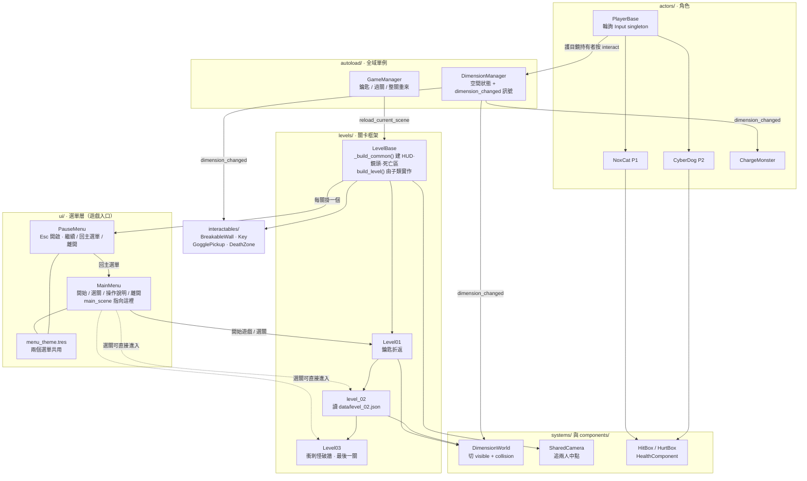

# NoxCat: Riftbound Co-op

> 雙人同機協力解謎平台遊戲 · Godot 4.7.2
> 隊伍：**水返腳(2).png**（隊伍代號 T054）
> [English README](README.en.md)

---

## 問題與目標

多數雙人合作遊戲給兩名玩家一模一樣的能力，「合作」因此退化成「一起走同一條路」—— 少一個人只是慢一點，不是過不去。

本作要解決的就是這件事：**讓兩名玩家的能力刻意不對稱，且互相依賴**。遊戲中存在兩個重疊的空間，同一個座標在「常態空間」與「異空間」有不同的平台。只有戴上護目鏡的黑貓 NoxCat 能切換空間，而賽博狗 CyberDog 完全沒有這個能力 —— 但要爬上塔頂、要誘使衝刺怪撞破牆，兩個人都得在場。關卡的柱間距刻意設計成大於一次跳躍的高度，讓「切換空間」成為唯一解法，而不是可有可無的花招。

**目標使用者**：兩名共用一台鍵盤、坐在同一張桌子前的玩家。
**預期影響**：把「溝通」變成通關的必要條件 —— 看得見平台的人必須說出來，踩得到平台的人必須相信。

## 核心功能

- **雙空間疊合世界** —— 非作用中的空間同時「看不見」且「站不上去」，切換是即時的（`systems/DimensionWorld.gd` 同步切換 `visible` 與所有子碰撞形狀的 `disabled`）
- **不對稱能力** —— 只有 NoxCat 能拾取護目鏡（CyberDog 用的是腕上裝置），因此只有貓能切換空間
- **共用鏡頭與牽繩** —— 單一鏡頭追兩人中點；兩人在 X 軸上最遠只能相距 820 px，往外走會被擋下，往回走永遠可以
- **第一關：鑰匙折返** —— 交替切換空間爬過階梯，在地圖最右端拿到鑰匙，再帶回出生點的門
- **第二關：資料驅動的垂直塔** —— 幾何完全由 [`data/level_02.json`](data/level_02.json) 定義，左側階梯只存在於常態空間、右側只存在於異空間，必須邊爬邊切換
- **第三關：誘導衝刺怪破牆** —— 切到異空間會激怒史萊姆，把牠引向裂開的牆，讓牠撞出通道。史萊姆平常在凹槽裡來回巡邏，只會偵測到「跟牠同一層」的玩家（站在高平台上的貓是安全的）；撞破牆後會播死亡動畫消失，撞歪則暈眩一下回到巡邏，可以再誘一次
- **過關要兩人到齊** —— 三關的出口都用同一套 `LevelBase.exit_trigger()`：兩名玩家都站進門框才過關，一人先到會顯示提示
- **死亡整關重來** —— 沒有生命數，任一人死亡或墜落，1 秒後整關重載
- **主選單與選關** —— 開始遊戲／**選擇關卡（第一／二／三關可直接進入）**／操作說明／離開；遊玩中按 `Esc` 暫停，可繼續、回主選單或離開遊戲
- **除錯 HUD** —— **預設隱藏**，F1 才叫得出來，顯示目前空間、護目鏡持有者、鑰匙狀態與雙方血量。玩家畫面上只留操作提示列

## 系統架構



依範本要求說明各層對應關係：

| 範本用語 | 本作的對應 |
|---|---|
| 前端 | Godot 客戶端本體即是全部畫面與互動；Web 版經 WebAssembly + WebGL2 在瀏覽器執行 |
| 後端 | **無**。純本地單機遊戲，執行時不發出任何網路請求 |
| 模型 | **僅開發期使用**。美術素材以影像生成模型產出後切幀，遊戲執行時不呼叫任何 AI 服務 |
| 資料庫 | **無**。關卡資料以靜態 JSON（`data/level_02.json`）在啟動時讀入 |
| 外部服務 | 僅 itch.io 作為 Web 版託管、GitHub Releases 作為桌面版發布 |

目錄職責：

| 目錄 | 內容 |
|---|---|
| `ui/` | **主選單、選關面板、Esc 暫停選單與共用主題** `menu_theme.tres`。`run/main_scene` 指向 `ui/MainMenu.tscn`，遊戲的入口在這裡 |
| `autoload/` | 兩個全域單例：空間狀態與跨關卡遊戲狀態 |
| `levels/` | `LevelBase` 關卡框架與各關實作。**關卡幾何在 GDScript 中以程式建構**，`.tscn` 只是掛腳本的空 `Node2D` |
| `actors/` | 玩家（`PlayerBase` + 兩個角色場景）與敵人 |
| `components/` | 可組合元件：`HitBox` / `HurtBox` / `HealthComponent` |
| `interactables/` | 鑰匙、護目鏡、可破壞牆、死亡區等互動物件 |
| `systems/` | 空間世界切換與共用鏡頭 |
| `assets/` | 美術（152 張 PNG）與音訊（8 wav + 3 mp3）素材 |
| `data/` | 靜態關卡資料（目前只有 `level_02.json`） |
| `tools/` | 音效合成腳本、本機靜態伺服器、匯出範本安裝腳本 |
| `docs/` | [發布指南](docs/release-guide.md)（GitHub Release 與 itch.io 上傳步驟），以及 `plan-v5.md`（**前一個原型的計畫文件，非現行架構**） |
| `development-log/` | 逐次開發決策紀錄，共 5 篇。最新一篇是 [主選單／過關統一／史萊姆重做](development-log/2026-09-05-menu-exit-unify-slime-rework.md) |
| `AGENTS.md` | 專案的協作規約與兩條架構通則（輸入一律輪詢 `Input` singleton；跨節點初始化一律父推子），程式碼實際遵循這兩條 |

## 使用技術

| 類型 | 技術／服務 | 用途 |
|---|---|---|
| AI 模型 | OpenAI ChatGPT Images 2.0（API 名 `gpt-image-2`） | **僅開發期素材製作**：產出角色、敵人、背景、平台的接觸表，再以團隊自寫流程切成單幀。遊戲執行時不呼叫任何 AI API |
| 前端 | Godot Engine 4.7.2 stable + GDScript，渲染器 `gl_compatibility` | 遊戲本體：畫面、輸入、2D 物理、關卡建構。Web 版經 WebAssembly + WebGL2 執行 |
| 後端 | 無 | 純本地單機遊戲，無伺服器、無網路請求、無資料庫。關卡資料以 `data/level_02.json` 靜態載入 |
| Sponsor 技術 | OpenAI ChatGPT（團隊自有帳號） | 開發期素材生成。主辦方提供的 Pro 方案與 API 額度至繳交前尚未開通，本作以團隊自有帳號完成，未使用贊助額度，亦未呼叫 OpenAI API |
| 發布平台 | itch.io（HTML5）、GitHub Releases | itch.io 提供點連結即玩的瀏覽器版；GitHub Releases 提供 Windows 單檔執行版 |
| 開發工具鏈 | Node.js、Python 3 | `tools/generate_dog_sfx.js` 程式化合成音效；`tools/serve.py` 供 Web 匯出本機檢視 |

> 渲染器固定為 `gl_compatibility` 是硬需求而非偏好：**WebGL2 只支援 Compatibility**，而本作必須能在瀏覽器裡遊玩。因此不使用 glow / SSAO / SDFGI / 體積霧 / 螢幕空間反射。

## 安裝與執行

### 方式一：瀏覽器直接玩

itch.io 頁面：*（建立後補上）*

### 方式二：下載 Windows 版

```
1. 前往本儲存庫的 Releases 頁面，下載 NoxCat-v1.0.0-windows.zip
2. 解壓縮
3. 雙擊 NoxCat.exe
```
執行檔已內嵌所有資源，解壓後單一 `.exe` 即可執行，不需安裝 Godot。

### 方式三：從原始碼執行

```bash
# 1. 安裝 Godot 4.7.2 stable（標準版即可，不需要 .NET 版）
#    https://godotengine.org/download

# 2. 取得原始碼
git clone https://github.com/RainYu0510/hackathon.git
cd hackathon

# 3. 用 Godot 開啟 project.godot，按 F5 執行
#    主場景為 ui/MainMenu.tscn
```

### 方式四：自行重現兩份匯出物

```bash
# 需先安裝 Godot 4.7.2 的匯出範本（編輯器選單：編輯器 → 管理匯出範本）
# Linux 使用者可用 tools/install_export_templates.sh 自動安裝

godot --headless --import
godot --headless --export-release "Windows Desktop" build/windows/NoxCat.exe
godot --headless --export-release "Web" build/web/index.html

# 本機檢視 Web 版（http://127.0.0.1:8099）
python tools/serve.py
```
匯出設定已納入版控（`export_presets.cfg`），因此上述指令在任何一份 clone 上都會產出相同結果。

### 操作方式

**兩名玩家共用一台鍵盤。**

| | 玩家 1 — NoxCat（黑貓） | 玩家 2 — CyberDog（賽博狗） |
|---|---|---|
| 左右移動 | `A` / `D` | `←` / `→` |
| 跳躍 | `W` | `↑` |
| 攻擊 | `F` | `K` |
| 互動／切換空間 | `G` | `L` |

| 遊戲中 | 作用 |
|---|---|
| `Esc` | 暫停（繼續／回主選單／離開遊戲） |
| `R` | 重新開始本關 |

| 除錯鍵 | 作用 |
|---|---|
| `F1` | 顯示／隱藏除錯 HUD（預設隱藏） |
| `F2` | 強制切到常態空間 |
| `F3` | 強制切到異空間 |

> 互動鍵是共用的：持有護目鏡時按下即切換空間，未持有時則是拾取／互動。
>
> 主選單與暫停選單的「離開遊戲」按鈕在**瀏覽器版會自動隱藏**（瀏覽器分頁無法自行關閉），只有桌面版看得到。

## 作品展示

- 作品展示網址（選填）：*尚未產出 —— itch.io 頁面建立後補上*
- 評選影片：*尚未產出*

## 限制與未來工作

以下為實際查證過的現況，非推測：

**關卡與流程**
- 目前**共三關可玩**：第一關 → 第二關 → 第三關，第三關為最後一關，通關後顯示 `LEVEL COMPLETE`，按 `R` 可重玩
- `levels/Level04.gd` / `Level04.tscn` 有完整可執行的程式碼（第三關的早期粗胚版，破牆即過關），但**沒有任何路徑指向它**，正常遊玩不會遇到
- `Level03_PLACEHOLDER.tscn` 與 `Level05_PLACEHOLDER.tscn` 是只顯示 `LEVEL DESIGN TBD` 的空槽，同樣無路徑指向
- 檔名有誤導性：`Level02_PLACEHOLDER.tscn` **不是**佔位關卡，它掛的是 `levels/level_02.gd`，是真正可玩的第二關

**機制的不一致與未接上的部分**
- **遊戲不播放任何音效**。`assets/audio/` 內 11 個音檔全數沒有被任何 `.gd` 或 `.tscn` 引用，遊戲中是無聲的
- **玩家攻擊在可玩關卡中沒有目標**：第三關的敵人（class 名為 `ChargeMonster`，借用史萊姆美術）沒有 `HurtBox`，無法被擊殺；唯一具備敵方 `HurtBox` 的 `Slime.tscn` 從未被任何關卡生成。因此 `F` / `K` 攻擊鍵在這三關裡打不到任何東西
- **第三關的敵人是一擊死亡**：其 `HitBox` 的 `damage = 99`，而玩家 `HealthComponent` 的 `max_health = 5`，被衝刺撞到即死並觸發整關重載
- **檢查點是純裝飾**：畫面上的門形物件不具復活功能。死亡一律整關重載，`GameManager.respawn_all()` 沒有任何呼叫者
- 玩家 2 的 `p2_left` / `p2_right` 在 `project.godot` 中綁定的 physical keycode 有誤（對應到 Insert 與 Pause）。方向鍵之所以能用，是靠 `actors/players/PlayerBase.gd` 中針對玩家 2 硬寫的後備輸入路徑
- 角色一旦持有護目鏡，互動鍵即被切換空間佔用，該角色無法再拾取其他物品
- **牽繩沒有任何視覺回饋**：兩人相距達 820 px 時往外的移動輸入會被直接歸零，畫面上不會有提示
- **約 32 張 PNG 未被使用**：`LevelBase.platform()` 只載入 `platform_02/03` 與其 crimson 版本，因此 `platform_01`、`platform_04`～`platform_12` 及對應的 crimson 版本皆未使用；此外傳送門美術（7 張）、兩張平台圖集、史萊姆的 jump 動畫（5 張）也未被引用
- `interactables/CollapsingPlatform.gd` 與 `ui/HUD.tscn` 是死路徑：`Level01._collapse()` 沒有呼叫者，`LevelBase.collapse_platforms` 永遠是空陣列；實際 HUD 由 `LevelBase._build_common()` 以程式建構，`ui/HUD.tscn` 沒有任何引用
- `levels/Level03.gd.uid` 與 `levels/Level04.gd.uid` 內容相同（重複的 UID），每次 `godot --headless --import` 會出現一則匯入警告，不影響執行

**尚未具備**
- 無單人模式、無音量或按鍵設定（暫停面板只有繼續／回主選單／離開遊戲）
- 無存檔，關閉後從第一關重新開始

**未來工作**
1. 接上音效播放，讓既有的 11 個音檔實際發揮作用
2. 修正 `p2_left` / `p2_right` 的 InputMap keycode，移除硬寫的後備路徑
3. 把 `Level04` 接進關卡流程，並補完第五關
4. 為衝刺怪加上 `HurtBox`，讓攻擊行為有意義

## 第三方服務、資料與素材

完整逐項清單見 **[CREDITS.md](CREDITS.md)**。摘要如下：

| 項目 | 來源 | 授權 | 備註 |
|---|---|---|---|
| Godot Engine 4.7.2 stable | https://godotengine.org | MIT License | 遊戲引擎；Web 版包含引擎產生的 JS/WASM 執行期程式碼，同為 MIT |
| 遊戲程式碼 | 團隊自行撰寫 | MIT（見 [LICENSE](LICENSE)） | 無任何第三方外掛或 addon |
| 美術素材（152 張 PNG） | 以 OpenAI ChatGPT Images 2.0（`gpt-image-2`）生成後由團隊自寫流程切幀 | 依 OpenAI 使用條款，產出歸使用者所有 | 生成於 2026-09-04～05；流程紀錄見 [開發日誌](development-log/2026-09-04-sprite-pipeline-and-player-art.md) |
| 音效 `dog_*.wav`（8 個） | 由 [`tools/generate_dog_sfx.js`](tools/generate_dog_sfx.js) 程式化合成 | MIT（隨本專案） | 完全原創，非取樣素材 |
| `jump.mp3` / `slime dead.mp3` / `slime walk.mp3` | **來源待確認** | **未確認** | 未被程式碼引用，且已在 `export_presets.cfg` 中排除，**不包含在任何發布版本內** |
| 字型 | 無自帶字型 | — | 全部使用 Godot 內建預設字型 |
| 關卡資料 `data/level_02.json` | 團隊自製 | MIT（隨本專案） | 無外部資料集 |

本儲存庫不包含任何 API 金鑰、Token、密碼或憑證檔案。

## 團隊成員

*分工依 commit 紀錄整理；姓名欄由成員自行填寫。*

| 姓名 | 分工 |
|---|---|
| 余萬崧 | [`RainYu0510`](https://github.com/RainYu0510) — 專案發起、儲存庫建立、第三關整合 |
| 許守呈 | [`0812tony96`](https://github.com/0812tony96) — 遊戲基礎實作、第一二關可玩版、角色與場景美術素材 |
| 林建良 | [`DecorousGoat914`](https://github.com/DecorousGoat914) — 音效素材與音效合成腳本 |
| 林秉昱 | [`kila606`](https://github.com/kila606) — 匯出與發布流程、工具鏈、專案文件 |

## License

本專案採用 **MIT License**，完整條文見根目錄的 [LICENSE](LICENSE) 檔案。

Copyright (c) 2026 水返腳(2).png (Team T054)

程式碼適用上述 MIT 授權。美術與音訊資產的來源與授權狀態另見 [CREDITS.md](CREDITS.md)。
